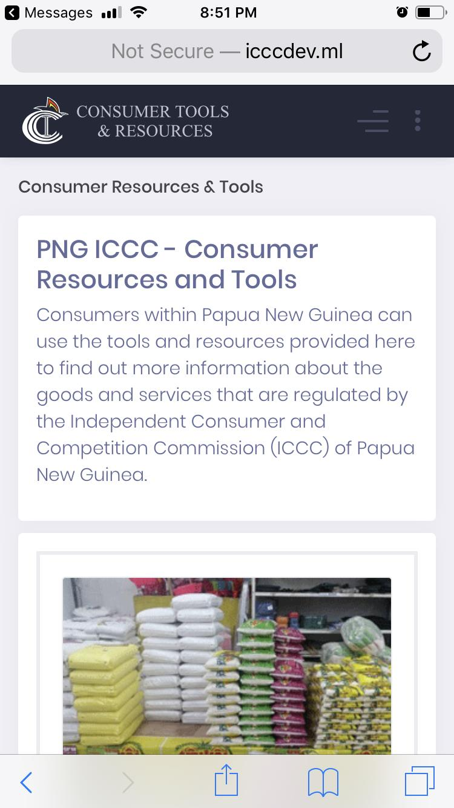

# Consumer Goods Price Monitor Web App

`PHP / CodeIgniter / CSS3 / SCSS / HTML5 / Bootstrap / JQuery / Javascript / Joomla`

### Access Web App

To access the app, go to the test site at [<u>https://cgpmtest.cloudcode.com.pg</u>](https://cgpmtest.cloudcode.com.pg/) and click on the “Consumer Resources & Tools” link.

### Landing/Home Page

### Declared Goods and Non-Declared Goods categories. 

Clicking on a categories will take you to the price watchlist page where it will only display goods under that category.

### Price Watchlist Table 

This is the main table that shows information about goods sold in the different regions. This is the main page that we expert users to interact with.

### Product View

### Shop View

### Maintain Goods

All goods that were provided in the excel sheet have been loaded.

### Maintain Shops

All Shops (including the fuel stations) that were provided in the excel spreadsheet have been loaded.

### Mobile Device View Screenshots (Apple iPhone 7s)

